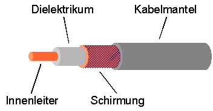

# Übertragungsmedien
## 1. Kupferkabel
### 1.1
* Telefonkabel / Fernmeldekabel
* Koaxialkabel
* Twisted-Pair-Kabel / Kupfer-Doppelader (DA)
	* Induktion kompensieren
	* unshielded twisted pair (utp)
	* screened/unshielded tp (s/utp)
	* stp/ftp (screened/foiled tp)

### 1.2
#### Telefonkabel / Fernmeldekabel
* einzelne parallele Adernpaare

#### Koaxialkabel
* Innenleiter aus dünnen & geflochtenen Kupferadern
* Kabelschirm aus geflochtenen Kupferadern
* Sonderformen
	* mehrere Innen- oder Außenleiter
	* Ferritummantelung

#### Twisted-Pair-Kabel
* Besteht aus einem oder mehreren Adern-Paaren (zwei miteinander vertrillte Adern)
* Leiterbündel / Seele: mehrere Adern-Paare zusammengefasst
* Schirm: metallische Schirmung der Adern
* Kabelmantel: ummantelt alle Adern-Paare

### 1.3
#### Koaxialkabel
* 10BASE2
* 10BASE5
* ARCNET
* Breitband
* Low-Noise

#### Twisted Pair
* Kategorie 1 bis Kategorie 8
	* Unterscheiden sich in:
		* Bandbreite
		* Typ der Schirmung

### 1.4
* Aufgrund des ohmschen Widerstands kommt es zu Leistungsverlust
	* Übertragungsgeschwindigkeit leidet

### 1.5
#### Twisted Pair
* RJ-XX
* RJ45

#### Koaxialkbel
* BNC (Bayonet Neill Concelman)
	* HF (1-4 GHz)
	* Funk- & Videotechnik
* TNC (Threaded Neill Concelman)
	* HF (bis ca- 11 GHz)
	* sollen Verbindung bei starker Vibration gewährleisten
* Belling-Lee
	* Für Mittelwelle gedacht
	* Fernsehgeräte & Radios ür UKW- & UHF-Antennen 
* 4/13-Steckverbinder
	* Ableitung des Banansteckers
	* kein eindeutig definierter Wellenwiderstand
		* unbrauchbar in der HF-Technik
* Dezifix
	* hermaphroditisch (wird nicht zw. Stecker und Buchse unterschieden)
	* 6 verschieden Größen
* C-Steckverbinder
	* Bajonettverschluss
	* bis 11 GHz geeignet
	* für hohe Leistungen
* F-Steckverbinder
	* Schraubverriegelung
	* für HF bis ca. 5 GHz geeignet
	* lässt sich auf das Kabel aufschrauben (Selbstmontage)
* FME (For Mobile Equipment)
	* biz 2 GHz geeignet
	* Miniatur-Stecker
	* kommen bei externen Mobilfunkantennen im KFZ zum Einsatz
* SMBA
	* viele Anwendungsbereiche
		* Antennensignale
		* Keyless-entry-Systeme
		* Mobilfunk
		* digitale Kamerasysteme
		* GPS
		* Telematik
	* bis 6 GHz spezifiziert
* MCX (Minature CoaX) / MMCS (Micro MCX) / SSMCX (Super Small MCX)
	* bis zu 6 GHz
	* ca. 4 mm Durchmesser
* UHF-Steckverbinder
	* für CB-Funk und Amateurfunkgeräte
* N-Steckverbinder
	* Schraubverriegelung
	* bis 11 GHz
	* meistverwendeter Steckverbinder in der professionellen HF-Technik
* Din-7/16-Steckverbinder
	* 7 mm Innenleiter-Durchmesser
	* 16 mm Dielektrum-Durchmesser
	* höhere Übertragungsleistungen als N-Steckverbinder
	* bis zu 1 GHz
* SMA-Stekcverbinder (Sub-Miniature-A)
	* Schraubverbinder
	* 1 GHz bis 18/26.5 GHz
	* für HF
	* moderne Stecker bi 27 GHz bzw. bei SSMA (Super SMA) bis 50 GHz
	* für den Weltraumeinsatz konzepiert
* RP-SMA / R-SMA (Reverse Polarity SMA)
	* Stift und Loch bei den Schraubverbindern vertauscht
* Cinch
* 3,5-mm-Stecker
	* mechanisch mit SMA kompatibel
	* niedrigere Toleranzen als SMA => teurer als SMA
* K-Steckverbinder
* V-Steckverbinder
* W-Steckverbinder
* WICLIC-Steckverbinder
* QN, QLF & QMA
* TS-9-Steckverbinder
* APC-Verbindung
	* hermaphroditisch
	* HF-Technik

#### Twisted Pair

* D-Sub (D-Subminiature)

* Registered Jack (RJ)
	* Bezeichnung: RJ-XX ('XX' entspricht einer Zahl)
	* z.B. RJ-45

## 2. Glasfaserkabel
### 2.1 Aufbau und Funktion
* typischerweise mehrere gebündelte Lichtwellenleiter
	* zum Schutz und zur Stabilisierung
* Aufbau einer Fase / eines Lichtwellenleiters
	* lichterfüllter Kern ist von einem optisch dünneren Mantel und einer Schutzschicht aus Kunststoff umgeben
* Funktion

	Es kommt an der Grenze zw. den beiden Materialien mit unterschiedlicher optischer Dichte bzw. Brechungsindex zur Totalreflexion. Dadurch kann sich ein Lichtstrahl durch den Leiter verbreiten.

### 2.2 Klassifizierung
* Multimodefaser
	* 50-1500 µm  Durchmesser
	* mehrere Moden können sich ausbreiten
* Monomodefaser
	* 3-9 µm Durchmesser 
	* nur eine sog. Grundmode kann sich ausbreiten

### 2.3 Längenberschänkungen
Durch fundamentale Materialeigenschaften und unerwünschte Verunreinigungen der Fasern kommt es zu Verlust der Signalstärke über längere Strecken. Dadurch ist die Länge der eines Glasfaserkabels begrenzt. Außerdem kommt es auch zur Dispersion. Sie ist von der Geschwindigkeit bzw. Wellenlänge des Lichts abhängig. Die Effekte der Dispersion steigen mit der Länge der Glasfaser.
### 2.4 Steckverbinungen
* F-SMA

* FC
* ST (BFOC)
* SC
* E-2000
* ESCON
* MIC (FDDI)
* MU (Mini-SC)
* LC
* URM

* MTRJ
* MPO/MTP
* M12 Optic
* TOSLINK

## 3. Strukturierte Verkabelung
### 3.1 
Strukturierte Verkabelung beschreibt ein Konzept mit dem universell und unabhängig von der Anwendung Netzwerkkabel innerhalb und zwischen Gebäuden verlegt werden. Dieses Konzept ist mit der Norm EN 50173 definiert. Dabei wird die Verkabelung in drei verschiedene Verkablungsarten / Bereiche unterteilt.
### 3.2 Verkablungsarten
#### Primärverkabelung
Mit dem Begriff Primärverkabelung meint man die Verkabelung von mind. zwei Gebäuden an einem Standort. Diese Verkabelung kann aus Glasfaser- oder Twisted-Pair-Kablen bestehen. (Von Standort- zu Gebäudeverteiler bzw. von Gebäude- zu Gebäudeverteiler)
#### Sekundärverkabelung
Sekundärverkabelung beschreibt die vertikale Verkabelung von einzelnen Stockwerken untereinander eines Gebäudes. Es werden Glasfaser- und Twisted-Pair-Leitungen verwendet. (Von Gebäude- zu Stockwerkverteilern)
#### Tertiärbereich
Die horizontale Verkabelung eines Stockwerks wird in der Strukturierten Verabelung Tertiärbereich genannt. Hier können Glasfaser- und Twisted-Pair-Kabel verwendet werden. (Von Stockwerkverteiler zu Anschlussdosen)

